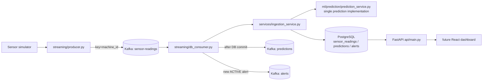

# Phase 3 architecture: PostgreSQL + Kafka + FastAPI



Layering: `route -> service -> repository -> SQLAlchemy -> PostgreSQL`. Routes contain no SQL; the consumer contains no ML code.

| Layer | Location |
|---|---|
| ML (unchanged from Phase 2) | `ml/` - `ml/prediction/prediction_service.py` is the only prediction engine |
| Events / Kafka | `streaming/` (`schemas.py`, `producer.py`, `consumer.py` (Phase 2, no DB), `db_consumer.py` (Phase 3)) |
| Services | `services/ingestion_service.py`, `alert_service.py`, `prediction_query_service.py` |
| Persistence | `db/` (models, session, `repositories/`), schema owned by `alembic/` |
| API | `api/` |

The Phase 2 `streaming/consumer.py` (no database) and the Streamlit/Flask apps are untouched.

## Topics
| Topic | Producer | Content |
|---|---|---|
| `sensor-readings` | `streaming/producer.py` | `SensorEvent` (optional `event_id`) |
| `predictions` | `db_consumer` after DB commit | `PredictionEvent` (`risk_score` = mean RF/XGB failure probability, **not calibrated**) |
| `alerts` | `db_consumer` when a NEW active alert was created | `AlertEvent` |

The topic names come from `KAFKA_SENSOR_TOPIC`, `KAFKA_PREDICTION_TOPIC`, `KAFKA_ALERT_TOPIC`. `.env.example` and
`docker-compose.yml` use the names above. **The code defaults for the first two stay `machine-sensor-data` /
`machine-predictions`** because Phase 2 tests assert them; set the env vars (or copy `.env.example`) to use the Phase 3 names.

## PostgreSQL schema (Alembic revision `0001`)
* `sensor_readings`: `UNIQUE(machine_id, timestamp)`, `UNIQUE(event_id)` (nullable), index `(machine_id, timestamp)`.
* `predictions`: `sensor_reading_id` FK + UNIQUE (one prediction per reading), CHECK `prediction IN ('NORMAL','FAILURE')`, CHECK `0 <= risk_score <= 1`.
* `alerts`: FKs to reading and prediction; CHECK `status IN ('ACTIVE','RESOLVED')`; CHECK `(status='RESOLVED') = (resolved_at IS NOT NULL)`;
  **partial unique index** `uq_alerts_active_machine_fault ON alerts(machine_id, fault_type) WHERE status='ACTIVE'`.
* All timestamps are `timestamptz`. `alerts.fault_type` is NOT NULL (`UNSPECIFIED` if the model flags FAILURE with no rule match), because NULLs would defeat the unique index.

## Transaction flow
```
poll -> validate -> BEGIN
                      INSERT sensor_reading ON CONFLICT DO NOTHING  (no row => duplicate => ROLLBACK-free exit, skip)
                      PredictionService.predict()
                      INSERT prediction
                      if prediction == FAILURE: INSERT alert ON CONFLICT (machine_id,fault_type) WHERE ACTIVE DO NOTHING
                    COMMIT
      -> publish predictions / alerts -> flush -> commit Kafka offset (this message only)
```
Crash before COMMIT: nothing persisted, offset not committed, Kafka redelivers. Crash after COMMIT, before offset commit:
redelivery hits `ON CONFLICT DO NOTHING` -> treated as duplicate, no second reading/prediction/alert.

## Alert policy
Alert iff the Phase 2 decision is `FAILURE` (no new threshold). If an ACTIVE alert already exists for the same machine and fault type
no new alert is created (the existing one is left unchanged). Resolve it with `POST /api/v1/alerts/{id}/resolve`; a later failure then opens a new alert.

## Failure handling
| Situation | Behaviour |
|---|---|
| Malformed / out-of-range message | logged with payload preview, skipped, offset committed |
| Duplicate event | skipped, no downstream re-publish, offset committed |
| `PredictionService` raises | transaction rolled back, logged, skipped, offset committed (cannot succeed on retry) |
| DB connection error | retried with exponential backoff (`--db-retries`); if it persists the consumer stops with exit code 5 **without committing**, so the message is redelivered after restart |
| Non-retryable DB error (integrity/data) | consumer stops (exit 5) without committing - never silently skipped |
| Kafka publish to predictions/alerts fails | logged + counted; DB is source of truth; offset still committed (see limitations) |
| Missing/invalid `DATABASE_URL`, non-PostgreSQL URL | exit code 2 at startup |
| Broker unreachable at startup / models missing | exit code 3 / 4 |

## Known limitations
* Downstream publishing happens after the DB commit, not atomically with it (no outbox). A crash between COMMIT and publish, or a publish that fails, loses that downstream event while the DB row exists; the redelivered message is a duplicate and is not re-published. An outbox table is the standard fix (future work).
* `PredictionService` runs inside the open DB transaction (a few ms); acceptable at this scale.
* The producer does not yet assign `event_id`s; idempotency relies on `(machine_id, timestamp)`.
* Single-node local Kafka (replication factor 1).

## Local setup
```powershell
copy .env.example .env            # edit POSTGRES_PASSWORD and DATABASE_URL to match
docker compose up -d
docker compose ps
alembic upgrade head
python -m streaming.db_consumer                        # terminal 1
python -m streaming.producer                           # terminal 2 (see docs/streaming.md for options)
uvicorn api.main:create_app --factory --port 8000      # terminal 3
# http://localhost:8000/docs
docker compose logs kafka ; docker compose logs postgres
docker compose down            # add -v to also delete the data volumes
```

## API
`GET /health`, `GET /ready` (503 if PostgreSQL or Kafka unavailable), `GET /api/v1/predictions`, `GET /api/v1/predictions/{id}`,
`GET /api/v1/machines/{machine_id}/predictions`, `GET /api/v1/alerts[?status=]`, `GET /api/v1/alerts/active`,
`GET /api/v1/machines/{machine_id}/alerts`, `POST /api/v1/alerts/{id}/resolve` (404 unknown, 409 already resolved).
List endpoints: `?page=1&page_size=50` (max 200) -> `{"data": [...], "pagination": {"page","page_size","total"}}`. Errors: `{"error","detail"}`; bad input -> 422; DB down -> 503.

## Testing
| Kind | Command | Needs |
|---|---|---|
| Unit + Phase 2 regression | `python -m pytest -q` | nothing |
| PostgreSQL integration (`-m postgres`) | included in the line above when `TEST_DATABASE_URL` (admin URL, e.g. `postgresql+psycopg://postgres:PW@localhost:5432/postgres`) or the `pgserver` package is available; otherwise skipped | real PostgreSQL |
| Kafka integration (Phase 2) | `$env:RUN_KAFKA_INTEGRATION="1"; python -m pytest tests/test_kafka_integration.py -q` | running broker |
| Kafka + PostgreSQL end-to-end | `$env:RUN_KAFKA_INTEGRATION="1"; $env:TEST_DATABASE_URL="..."; python -m pytest tests/phase3/test_e2e_kafka_postgres.py -v` | broker + PostgreSQL |

Consumer tests in `tests/phase3/test_db_consumer.py` use a **fake Kafka client**; two of them use real PostgreSQL. They verify offset ordering and
redelivery logic but are not Kafka integration tests.
