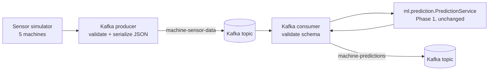

# Streaming (Phase 2): simulator -> Kafka -> PredictionService

> **The sensor data in this pipeline is SIMULATED.** It is synthetic data for demonstrating the architecture,
> generated by `simulation/sensor_simulator.py`. It is not real industrial sensor data and says nothing about real machines.

## Architecture



The consumer contains **no ML code**. It calls the Phase 1 `PredictionService`, which loads the trained artifacts.
A test (`test_architecture_rule_no_ml_code_in_the_streaming_package`) fails if sklearn/xgboost/joblib appear in `streaming/`.

## Why Kafka

* **Decoupling:** the producer never waits for the models; the consumer never waits for the sensors.
* **Buffering and replay:** events are stored in the topic, so a consumer that is down or slow catches up later, and a new
  consumer (the Phase 3 database writer, the Phase 4 API) can re-read history.
* **Per-machine ordering and scale-out:** messages are keyed by `machine_id`, so one machine's readings stay in order inside one
  partition, and more consumers in the same group can share the partitions.
* **Standard protocol:** the producer and consumer use the standard `confluent-kafka` client.

## Topics

| Topic | Env variable | Content | Key |
|---|---|---|---|
| `machine-sensor-data` | `KAFKA_SENSOR_TOPIC` | one sensor reading (`SensorEvent`) | `machine_id` |
| `machine-predictions` | `KAFKA_PREDICTION_TOPIC` | the prediction for that reading (`PredictionEvent`) | `machine_id` |

**Why a second topic:** predictions are an output other components need independently: the Phase 3 database writer, the Phase 4
API/WebSocket and the alert engine can subscribe to `machine-predictions` without re-running the models or depending on the consumer's
internals. Topics are created automatically (3 partitions, replication factor 1: single-broker local defaults).

Other settings: `KAFKA_BOOTSTRAP_SERVERS` (default `localhost:9092`), `KAFKA_CONSUMER_GROUP` (default `prediction-service`),
`KAFKA_AUTO_OFFSET_RESET` (`earliest`), `KAFKA_TOPIC_PARTITIONS` (3). They live in `ml/config.py` (`KafkaSettings`); see `.env.example`.
No credentials are stored anywhere in the code.

## Event schemas (`streaming/schemas.py`, Pydantic)

`SensorEvent`: strict types (a string or boolean is rejected, not coerced), no unknown fields, a timezone-aware timestamp (normalised to UTC,
millisecond resolution), and sensor ranges taken from `ml.preprocessing.SANITY_BOUNDS`, the same plausibility limits the PredictionService
enforces. Invalid messages are rejected with every problem listed.

| Field | Type | Notes |
|---|---|---|
| `machine_id` | string | `[A-Za-z0-9][A-Za-z0-9_-]{0,63}` |
| `timestamp` | ISO-8601, UTC | e.g. `2026-10-07T08:56:19.727Z` |
| `air_temperature` | number, K | 250-350 |
| `process_temperature` | number, K | 250-400 |
| `rotational_speed` | number, rpm | 0-10000 |
| `torque` | number, Nm | 0-200 |
| `tool_wear` | number, min | 0-1000 |
| `product_type` | `"L"`, `"M"`, `"H"` (optional) | only refines the OSF rule; the simulator sends it |

Example sensor event (captured from a real run):

```json
{"machine_id": "MACHINE-001", "timestamp": "2026-10-07T08:56:19.727Z", "air_temperature": 298.4, "process_temperature": 309.1, "rotational_speed": 1692.0, "torque": 33.7, "tool_wear": 43.9, "product_type": "L"}
```

`PredictionEvent` (`risk_score` is the Phase 1 model-derived score, the mean of the RF and XGBoost failure probabilities. It is **not** a
calibrated probability or confidence):

```json
{"machine_id":"MACHINE-001","timestamp":"2026-10-07T08:56:19.727Z","status":"NORMAL","risk_score":0.00007427639502566308,"fault_type":null,"model_method":"rf_only_tuned_threshold","fault_indicators":[],"rf_prediction":0,"xgb_prediction":0,"isolation_prediction":0,"model_version":"ae0e75cd1337","processed_at":"2026-10-07T08:56:19.860Z"}
```

```json
{"machine_id":"MACHINE-001","timestamp":"2026-10-07T08:56:25.327Z","status":"FAILURE","risk_score":0.7068226130803426,"fault_type":"OSF","model_method":"rf_only_tuned_threshold","fault_indicators":["OSF"],"rf_prediction":0,"xgb_prediction":1,"isolation_prediction":1,"model_version":"ae0e75cd1337","processed_at":"2026-10-07T08:56:40.137Z"}
```

`fault_type` is `null` for NORMAL. For a FAILURE it is the rule-based code(s), e.g. `OSF` or `HDF+PWF`, or `RNF` as the residual label when no
rule explains the failure (Phase 1 assumption). `fault_indicators` lists the rule conditions that hold whatever the status.

## Sensor simulator

Run alone (JSON lines on stdout, logs on stderr): `python -m simulation.sensor_simulator --interval 1 --machines 5 --seed 42`

* **Normal operation** is generated from relationships measured on the normal rows of AI4I 2020: torque and speed are strongly inversely
  related (rpm = 2162.7 - 15.71 x torque + noise, correlation -0.89), process temperature follows air temperature (correlation 0.88),
  the temperature gap is about 10 K. Values are never independent random numbers. Measured on 15,000 simulated readings:
  means air 299.9 K / process 310.0 K / torque 39.1 Nm / speed 1549 rpm (AI4I: 300.0 / 310.0 / 39.6 / 1540).
* **Life cycle per machine:** normal -> **degrading** (gradual drift) -> **fault** (condition fully developed) -> **recovering** (maintenance) -> normal.
  A scenario starts at random with `--failure-probability` per reading, or on demand with `SensorSimulator.inject(machine_id, code)`.
* **Fault scenarios use the thresholds in `ml/fault_classification.py`** (imported, not copied): TWF drifts tool wear into the 200-240 min window;
  HDF shrinks the temperature gap below 8.6 K while speed falls below 1380 rpm (torque rises with it, as in the real HDF rows);
  PWF takes power outside 3500-9000 W (overload or under-power); OSF raises tool wear x torque above the product-type limit; RNF has **no sensor
  signature** (random by definition), only a label in the simulator's own log.
* The simulator's ground truth (`scenario`, `phase`) is logged but **never sent to Kafka**.
* Timestamps strictly increase (millisecond resolution), so (`machine_id`, `timestamp`) identifies a reading.
* Options: `--interval`, `--machines`, `--failure-probability`, `--degradation-rate` (simulated tool-wear minutes per reading, time-compressed), `--seed`.

How the Phase 1 model responds to the simulated faults (40 seeds each, fault phase only; for comparison, the same model on the real AI4I
test rows detects HDF 28/29, PWF 13/13, OSF 15/16, TWF 2/10, RNF 0/4):

| Scenario | Rule from `fault_classification.py` fires | Model flags FAILURE |
|---|---|---|
| TWF | 100% | 16.5% |
| HDF | 100% | 95.8% |
| PWF | 100% | 100% |
| OSF | 100% | 97.3% |
| RNF | no signature | 0% |

So **TWF and RNF failures are largely invisible to the model** (a Phase 1 finding that the simulation faithfully reproduces); this is
expected, not a pipeline bug. Normal-phase readings were flagged in 0% of these runs (and 0.12% in 5,000 normal-only readings).

## Producer (`streaming/producer.py`)

`python -m streaming.producer` starts the simulator, validates each event with `SensorEvent`, serialises it to JSON and publishes it.
Invalid events are logged and **not** published. Delivery is confirmed asynchronously and logged. Connection handling: on start it waits for the
broker with exponential backoff (`--connect-timeout`, default 60 s), then exits with code 3 if the broker never answers; at run time the client
retries internally, a full local queue is retried, failed deliveries are logged and counted. SIGINT/SIGTERM trigger a graceful shutdown that flushes
in-flight messages. Delivery is acks=all and at-least-once, so a retry can duplicate a message.

## Consumer (`streaming/consumer.py`)

`python -m streaming.consumer` subscribes to `machine-sensor-data` (group `prediction-service`), validates every message, calls
`PredictionService.predict()`, logs the result and publishes a `PredictionEvent` to `machine-predictions`. Offsets are committed **after** the
predictions of the messages read so far were flushed (at-least-once: a crash re-processes, never skips). A message that fails validation or
prediction is logged, counted and skipped so one bad message cannot block the stream (a dead-letter topic is a future improvement).
`--idle-timeout` counts from partition assignment. Exit codes: 0 ok, 2 bad configuration, 3 broker unreachable, 4 model artifacts missing.

## How to run

Prerequisites: `pip install -r requirements.txt`, trained artifacts present (`python -m ml.training.train` if `ml/artifacts` is missing), and a
Kafka-compatible broker on `localhost:9092` (see the next section). Use three terminals (PowerShell).

Run (terminal 1, consumer first so it has joined its group):
```powershell
python -m streaming.consumer
```
Run (terminal 2, producer and simulator):
```powershell
python -m streaming.producer --interval 1 --machines 5 --failure-probability 0.02 --seed 12
```
Optional (terminal 3): watch the simulator alone, with no Kafka: `python -m simulation.sensor_simulator --interval 0.5 --seed 12`

Environment (PowerShell): `$env:KAFKA_BOOTSTRAP_SERVERS = "localhost:9092"`. Stop with Ctrl+C.

### A broker for local use

* **What I used to verify this phase:** [Nisshi](https://github.com/nisshi-io/nisshi) (formerly Tansu) v0.7.0-pre.2, a Kafka-protocol-compatible broker
  (memory storage), started with `nisshi broker --listener-url tcp://127.0.0.1:9092 --advertised-listener-url tcp://localhost:9092 --storage-engine memory://nisshi/`.
  **It is not Apache Kafka.** I had no Docker and no access to the Apache download hosts in my environment.
* **Apache Kafka** (not tested by me): for example `docker run -p 9092:9092 apache/kafka:latest`. The client code uses only standard Kafka
  protocol features (metadata, produce, fetch, consumer groups, offset commit, topic admin), so it is expected to work, but confirm with
  `RUN_KAFKA_INTEGRATION=1 python -m pytest tests/test_kafka_integration.py -v`. Phase 6 adds Docker Compose.

## Example run (captured, simulated data, seed 12, 500 readings)

Producer:
```
2026-10-07 08:56:19,719 | INFO    | streaming.producer | Producer starting: 5 simulated machines -> topic 'machine-sensor-data' on localhost:9092 (SIMULATED DATA, not real sensors)
2026-10-07 08:56:19,723 | INFO    | streaming.kafka | Connected to Kafka at localhost:9092
2026-10-07 08:56:19,827 | INFO    | streaming.producer | Published sensor reading for MACHINE-002 (partition=1 offset=0)
2026-10-07 08:56:19,828 | INFO    | streaming.producer | Published sensor reading for MACHINE-004 (partition=1 offset=1)
2026-10-07 08:56:19,828 | INFO    | streaming.producer | Published sensor reading for MACHINE-005 (partition=1 offset=2)
2026-10-07 08:56:19,927 | INFO    | simulation | MACHINE-005: failure injected (OSF) - gradual degradation begins [simulation]
2026-10-07 08:56:20,627 | INFO    | simulation | MACHINE-003: failure injected (RNF) - gradual degradation begins [simulation]
2026-10-07 08:56:20,028 | INFO    | streaming.producer | Published sensor reading for MACHINE-005 (partition=1 offset=8) [simulated scenario: OSF/degrading]
2026-10-07 08:56:21,327 | INFO    | simulation | MACHINE-005: OSF fault fully developed [simulation]
2026-10-07 08:56:29,633 | INFO    | streaming.producer | Producer stopped: enqueued=500 delivered=500 failed=0 invalid=0
```
Consumer:
```
2026-10-07 08:55:55,737 | INFO    | streaming.consumer | PredictionService ready (decision method: rf_only_tuned_threshold, model ae0e75cd1337)
2026-10-07 08:56:18,932 | INFO    | streaming.consumer | Assigned partitions: [0, 1, 2]
2026-10-07 08:56:19,860 | INFO    | streaming.consumer | Received sensor reading MACHINE-001 @ 2026-10-07T08:56:19.727+00:00 (partition=2 offset=0)
2026-10-07 08:56:19,860 | INFO    | streaming.consumer | Prediction generated for MACHINE-001: NORMAL risk_score=0.00 method=rf_only_tuned_threshold
2026-10-07 08:56:19,924 | INFO    | streaming.consumer | Prediction generated for MACHINE-002: NORMAL risk_score=0.00 method=rf_only_tuned_threshold
2026-10-07 08:56:25,361 | WARNING | streaming.consumer | Prediction generated for MACHINE-005: FAILURE risk_score=0.65 fault_type=OSF method=rf_only_tuned_threshold
2026-10-07 08:56:25,708 | WARNING | streaming.consumer | Prediction generated for MACHINE-005: FAILURE risk_score=0.58 fault_type=OSF method=rf_only_tuned_threshold
2026-10-07 08:56:40,263 | WARNING | streaming.consumer | Prediction generated for MACHINE-004: FAILURE risk_score=0.39 fault_type=HDF method=rf_only_tuned_threshold
2026-10-07 08:57:03,698 | INFO    | streaming.consumer | Consumer stopped: received=500 normal=391 failures=109 invalid=0 prediction_errors=0 published=500 publish_errors=0 mean_processing_ms=71.36
```

## Troubleshooting

| Symptom | Cause / fix |
|---|---|
| `Kafka connection unavailable ... retrying` then exit code 3 | No broker at `KAFKA_BOOTSTRAP_SERVERS` (or `--bootstrap-servers`). Start one; check host/port. |
| Consumer logs "subscribed" but nothing for a long time | The consumer-group join is still running. It took **~23 s** on the Nisshi broker; Apache Kafka's default is about 3 s. Wait for `Assigned partitions`. A warning is logged every 15 s. |
| Consumer finishes long after the producer | Per-message prediction costs about 70 ms on one CPU (see Limitations); the consumer is behind, not stuck. The default 5 msg/s is well within its capacity. |
| `Invalid sensor event ... rejected` | The message failed schema validation; the log shows every problem and the start of the payload. |
| `Model artifacts unavailable` (exit 4) | Run `python -m ml.training.train`. |
| Nothing consumed from old messages | A group that already committed offsets resumes after them. Use a new `--group`, or `--offset-reset earliest` with a new group. |
| `BufferError` / "queue full" warnings | The producer is faster than the broker; messages are retried. |

## Verification status

Unit tests need no broker: `python -m pytest tests -q`. Real-broker tests (skipped unless `RUN_KAFKA_INTEGRATION=1`):
`tests/test_kafka_integration.py` (full pipeline, invalid messages, resume from committed offsets). Both were run for this phase against Nisshi
(see the Phase 2 report), and the two command-line programs were also run as separate processes.

## Limitations

* Verified against a Kafka-compatible broker, not Apache Kafka (see above). Single broker, replication factor 1, memory storage (data is lost when it stops), no TLS/SASL.
* At-least-once delivery: duplicates are possible; treat (`machine_id`, `timestamp`) as the identity of a reading in Phase 3.
* The consumer predicts one message at a time: about 70 ms per message on one CPU (a fixed per-call cost of the three 300-tree models), so roughly 14 msg/s.
  Measured with `predict_many`: 50 readings in 65 ms, i.e. 1.3 ms per reading. Micro-batching is the obvious next optimisation.
* Messages that fail validation or prediction are skipped (no dead-letter topic yet).
* Machines are hashed onto 3 partitions (observed split 1/3/1 machines), so the load is uneven.
* Simulated data only; TWF and RNF failures are mostly not detected by the model (see the table above).
* No schema registry; the schema is enforced in code by the producer and consumer.
